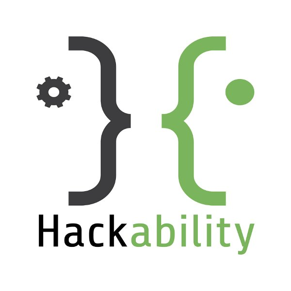

# How to Organize your Project

Each Hackability project will be published on the [Hackability official GitHub Page](https://github.com/HackabilityNPO). Take this repository as a starting point on
how to organize the project.

## Repository Organization

Each Hackabilty Project **must be** well documented and organized in order to be considered concluded.
There is no a general rule on how to document a project. The documentation have to enable an user with good knowledge 
to replicate and improve the project without much effort. Hence, you must organize and document the 
project in a propre way and include all files you produced during the project and as much informationa as possible.

Except for the `README.md` file, **that is mandatory**, here you can find some guidelines on how to organize 
your GitHun Project repo.

### The Repository should be organized as following

 - `README.md`. Put here general information about the project. This file must be written in [Markdown]()
    1. Name and high level description of the project,
    2. Name and date of the Hackability (e.g., Hackability@Polito, 2015)
    3. Detailed description of the project, with impages and information about the state of development of the project
    4. Credits, e.g., Team name and components, image of the team, acknowledgments, external links where the project have been published etc.
    5. License.

- `mechanics/`. Put here all digital files describing mechanics components developed for the project.
- `electronics/`.  Put here all digital files describing electronics components developed for the project.
- `software/`. Put here all the software developed.
- `documentation/`. Put here all documentations produced. 
- `tutorials/`. Put here all tutorials describing how to use and replicate the project.
- `images/`. Put here all images (including photos of the work, schematics, etc.)
- `videos/`. Put here all videos produced. If videos have been published to different platofrm (like YouTube), include a file `videos/external.md` with links to external videos.

## Where I can Share my project?

You can publish your project on every sharing platform you prefer. Please add on the README.md file of your repo project all information about other platform where the project exists.

## Where to create the project repository

You can create the project repository on your personal GitHub account or organization. Once the project
is concluded and documented, Hackability will fork your repo on the [Hackability official GitHub Page](https://github.com/HackabilityNPO).

## General Notes

When publishing files, please include both proprietary editable and open format of the same file.

Include all foto material on this repo! Not link images from external links. 

Use Markdown for documentation. You can find a [here great introduction to markdown](https://guides.github.com/features/mastering-markdown/) and some [nice tutorials here](https://www.markdowntutorial.com/).

## Examples
 - [Hackability@Barilla - Artù](https://github.com/HackabilityNPO/HackabilityBarilla17-Artu)

## Metanotes :O

Anyone can collaborate to this repo by extending this documentation and creating some tutorials on how to create and organize your
repo. It will be super interesting if someone, while organizing a specific project, can do videos recoring or tutorial on how to do
practically the project organization.

Very well documented project will be linked here as examples!

## License

TO BE DEFINED

## Contributors
 - [Ludovico Russo](https://github.com/ludusrusso)
